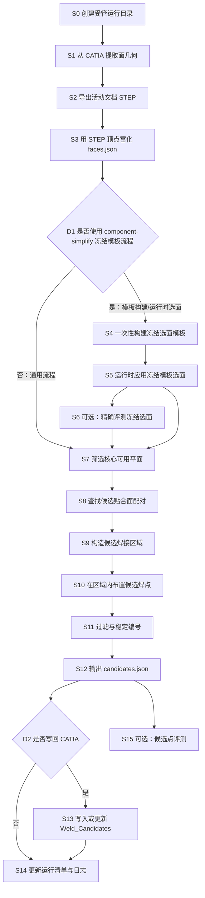

# 算法流程说明

本文基于当前代码说明仓库从 CAD 面数据到候选焊点的完整算法流程。这里的“焊点候选”指算法认为可能需要点焊的位置；V1 只自动生成 `two_layer`（两层板）候选，结果仍面向人工复核。

核心代码分为三类：

- CATIA 读写层：`catia/extract_faces.py`、`catia/export_step.py`、`catia/write_candidates.py`，通过 pycatia/COM 与 CATIA V5 交互。
- 离线几何与算法核心：`src/weld_core/`，不依赖 pycatia/pywin32。
- 受管运行脚本：`scripts/`，负责将原始输入、运行产物和清单串起来。

## 整体流程图

## 执行步骤

### S0 创建受管运行目录

- 输入：`part_id`、运行标签、运行参数；由 `scripts/run_full_pipeline.py` 或 `scripts/select_template_planes.py` 调用。
- 输出：`data/<part-id>/<run-id>/manifest.json`。
- 执行的算法或处理：`src/weld_core/data_layout.py` 校验 `part_id` 和运行标签格式，读取 `raw_data/<part-id>/manifest.json`，按角色校验原始输入文件存在性、SHA-256 和文件大小，然后创建唯一运行目录。
- 存在原因：把每次运行的输入、参数、产物和状态固定到同一目录，保证可追溯。
- 产生或修改的数据、状态、文件：创建运行目录和 `manifest.json`，初始 `status` 为 `running`。
- 分支、循环、异常：若清单缺失、输入哈希不一致、路径越界或运行标签非法，抛出 `DataLayoutError`，调用脚本以失败退出。

### S1 从 CATIA 提取面几何

- 输入：活动 CATIA Part/Product 文档、可选 `--part-number`、可选 `--limit`。
- 输出：`FacesDocument`，在一键流程中写为 `faces.json`。
- 执行的算法或处理：`catia/extract_faces.py` 使用 `Selection.Search("Topology.CGMFace,all")` 遍历面；Product 语境下通过 `leaf_product.PartNumber` 识别零件，并用 `SPAWorkbench.GetMeasurableInContext` 读取面积、平面和重心；Part 语境下用 `GetMeasurable`。`GetPlane()` 成功则标记 `planar`，失败则标记 `non_planar`。面积从 m² 转为 mm²。
- 存在原因：从 CATIA 获得算法所需的基础几何量和零件归属。
- 产生或修改的数据、状态、文件：生成 `faces.json`；每个 `FaceRecord` 包含 `id`、`part`、`surface_type`、`area`、`normal`、`plane_origin`、`centroid` 等字段。由于当前 CATIA COM 逐面顶点提取不可靠，`vertices` 恒为空，`manual_review=True`，并记录原因。
- 分支、循环、异常：逐面循环处理；`--limit` 达到数量后停止；`--part-number` 不匹配的面跳过；面积或重心读取失败会记录 warning 并继续；非平面面不会中断流程。

### S2 导出活动文档 STEP

- 输入：活动 CATIA 文档。
- 输出：运行目录下的 `component.stp`。
- 执行的算法或处理：`catia/export_step.py` 调用 CATIA `Document.ExportData(path, "stp")`，使用绝对路径导出 STEP。
- 存在原因：CATIA COM 无法可靠提供逐面顶点，后续需要用 STEP 和 OCP/OCCT 离线解析真实边界。
- 产生或修改的数据、状态、文件：写入 `component.stp` 并在运行清单登记 `step` 产物。
- 分支、循环、异常：导出失败时异常向上传递；一键流程会把运行清单状态改为 `failed`。

### S3 用 STEP 顶点富化 faces.json

- 输入：S1 的 `FacesDocument`、S2 的 `component.stp`。
- 输出：补全后的 `faces.enriched.json`。
- 执行的算法或处理：`scripts/enrich_faces_with_step.py` 调用 `src/weld_core/step_geometry.py` 解析 STEP 的 XCAF 装配树，保留零件名和全局装配坐标；对每个 STEP face 提取去重顶点、面积、重心，并用 SVD 最小二乘拟合平面，最大残差 `< 0.01 mm` 判为平面。随后按零件分组，将 CATIA COM 平面与 STEP face 做贪心一对一匹配：重心距离 `<= 1.0 mm`、法向角 `<= 2.0°`、面积相对差 `<= 0.05` 的候选按代价排序后匹配。
- 存在原因：给核心算法补齐 `vertices`，并用离线 STEP 解析修正 COM 提取阶段无法判断的边界信息。
- 产生或修改的数据、状态、文件：写入 `faces.enriched.json`；匹配成功的平面填充 `vertices`、清除 `manual_review`；未匹配、零件缺失或 STEP 判定为非平面的记录保留 `manual_review=True` 并写入 `reason`。
- 分支、循环、异常：按零件循环，再按 COM face 与 STEP face 生成候选匹配；STEP 解析失败会中断；零件缺失和单面未匹配只影响对应 face，不中断整体富化。

### S4 一次性构建冻结选面模板

- 输入：`raw_data/<part-id>/manifest.json` 中登记的 `primary_model` STEP 和 `surface_reference` STEP。
- 输出：冻结模板，例如 `templates/component-simplify/plane-selection-template.json`。
- 执行的算法或处理：`scripts/build_plane_selection_template.py` 解析主 STEP 和人工参考 STEP；`src/weld_core/plane_reference_labels.py` 为平面 face 分配稳定 STEP 遍历索引；对同一 part 内的主/参考平面计算法向角、平面距离和 OCCT 布尔公共面积。只有参考面唯一对应一个主面，且 source 覆盖率 `>= 0.95` 时才生成标签；`src/weld_core/plane_selection_template.py` 再把标签冻结为模板，并记录主/参考 SHA-256、阈值、`part`、`step_face_index`、面积、重心、法向和边界指纹。
- 存在原因：把人工参考面转化为运行时可复用、可审计的“只选这些主模型平面”的规则。
- 产生或修改的数据、状态、文件：写入或更新模板 JSON；不直接产生候选焊点。
- 分支、循环、异常：`--dry-run` 只输出标签通过情况，不写模板；若任何参考面无唯一匹配或存在歧义，`summary.passed=False` 且脚本失败；模板校验失败时不写出可用模板。

### S5 运行时应用冻结模板选面

- 输入：`part_id`、冻结模板、`raw_data/<part-id>` 中登记的 `primary_model` STEP。
- 输出：`faces.selected.json`、`selection_audit.json`。
- 执行的算法或处理：`scripts/select_template_planes.py` 先读取模板并校验 `part_id`，再校验主 STEP SHA-256 必须等于模板 `source_sha256`。`src/weld_core/template_plane_selection.py` 重新解析主 STEP，按 `(part, step_face_index)` 找到模板要求的平面，并重新计算顶点边界指纹；所有身份和指纹一致后，输出只包含冻结选面的 `FacesDocument`。
- 存在原因：运行时不再读取人工参考 STEP，只用主 STEP 和冻结模板安全复现选面。
- 产生或修改的数据、状态、文件：在新运行目录中写入 `faces.selected.json` 和覆盖全部主 STEP 平面的 `selection_audit.json`，并登记到 `manifest.json`。
- 分支、循环、异常：任何 SHA、索引、平面性或边界指纹不一致都会失败关闭，不写部分选面结果；未在模板中的主 STEP 平面写入审计，状态为 `excluded`，原因是 `not_in_frozen_template`。

### S6 可选：精确评测冻结选面

- 输入：S5 的运行目录、登记的 `primary_model` STEP 和 `surface_reference` STEP。
- 输出：`plane_selection_evaluation.json`、`plane_selection_evaluation.md`。
- 执行的算法或处理：`scripts/evaluate_template_plane_selection.py` 读取 `faces.selected.json`，在主 STEP 中重新定位选中 face，再用 `src/weld_core/exact_plane_selection_evaluation.py` 与参考 STEP 平面计算精确 TP/FP/FN。匹配条件使用法向角、平面距离和 `src/weld_core/exact_face_overlap.py` 的 OCCT 布尔公共 CAD 面积，非投影 AABB。
- 存在原因：证明冻结模板选出的平面和人工参考平面一致；这是评测路径，不是运行时候选生成所必需。
- 产生或修改的数据、状态、文件：写入评测 JSON 和 Markdown 报告，并登记到运行清单。
- 分支、循环、异常：每个参考面遍历同 part 的选中面；没有匹配记为 FN，多个匹配记为 ambiguous 并按 FN 处理；precision `> 0.90` 且 recall `> 0.95` 时 `passed=True`，否则脚本返回失败。

### S7 筛选核心可用平面

- 输入：通用流程的 `faces.enriched.json`，或 `component-simplify` 流程的 `faces.selected.json`。
- 输出：核心算法内部的 `eligible` face 列表。
- 执行的算法或处理：`src/weld_core/pipeline.py` 只保留 `surface_type == "planar"`、`manual_review == False` 且 `vertices` 非空的面。
- 存在原因：后续投影、AABB 和布点都依赖平面法向和边界顶点；不可信或不完整的面不能自动生成焊点。
- 产生或修改的数据、状态、文件：不直接写文件，只产生内存列表。
- 分支、循环、异常：若从命令行运行且输入位于 `component-simplify` 受管目录，`_template_provenance()` 强制要求输入文件名和清单产物为 `faces.selected.json`，并要求模板 SHA 与主 STEP SHA 追溯信息存在；不满足则失败。

### S8 查找候选贴合面配对

- 输入：S7 的 `eligible` face 列表、`WeldParams`。
- 输出：候选面二元组列表。
- 执行的算法或处理：`src/weld_core/pairing.py` 先用 NumPy 矩阵计算所有 face 法向的两两夹角，比较时取绝对点积，因此反向法向也视为平行；只保留角度 `<= max_normal_angle_deg` 的组合。随后逐对过滤：同一 part 跳过；面间距 `> max_gap_mm` 跳过；把两张面的顶点投影到 face A 的平面，计算 2D AABB（轴对齐包围盒），没有重叠则跳过。
- 存在原因：用低成本规则粗筛可能贴合的两张板面，避免对所有面做昂贵区域计算。
- 产生或修改的数据、状态、文件：生成内存中的 `(face_a, face_b)` 列表。
- 分支、循环、异常：face 数少于 2 时直接返回空列表；外层组合只遍历上三角，避免重复配对；零长度法向会在归一化时抛出异常。

### S9 构造候选焊接区域

- 输入：S8 的每个面配对、`WeldParams`。
- 输出：`Region` 列表，或对无效配对返回 `None`。
- 执行的算法或处理：`src/weld_core/region.py` 以 face A 的单位法向为厚度方向，计算 face B 原点到 face A 平面的有符号距离，并把 `plane_origin` 放在两面中间；将两张面的顶点投影到这个中面，求 2D AABB 交集，交集的短边若 `< min_face_width_mm` 则拒绝，否则形成候选焊接区域。
- 存在原因：把“可能贴合的两张面”转为可布点的近似重叠区域；V1 明确使用投影 AABB 近似，不求复杂轮廓精确交集。
- 产生或修改的数据、状态、文件：生成 `Region`，包含关联 face id、中面原点、法向、2D 重叠框、gap 和法向角。
- 分支、循环、异常：没有 AABB 重叠或宽度不足时返回 `None`，该配对不再进入布点。

### S10 在区域内布置候选焊点

- 输入：S9 的 `Region`、`WeldParams`。
- 输出：临时 `Candidate` 列表。
- 执行的算法或处理：`src/weld_core/points.py` 计算区域宽高，选择较长轴。若长边 `< min_spacing_mm`，只在 2D 中心放一个点；否则点数为 `ceil(long_dim / max_spacing_mm) + 1` 且至少 2 个，沿长轴均匀分布，另一轴取中心线。所有 2D 点再反投影回 3D 中面，并为区域四角计算 3D `region_bbox`。
- 存在原因：把候选区域转化为工程师可复核的离散焊点候选，并将点放在两张面的中间厚度位置。
- 产生或修改的数据、状态、文件：生成候选点，临时 id 形如 `<face_a>~<face_b>#<i>`，`layer_type` 当前恒为 `two_layer`，并记录 spacing 和 reason。
- 分支、循环、异常：小区域单点，长条区域多点；三层板自动分类当前未实现。

### S11 过滤与稳定编号

- 输入：S10 收集到的全部临时候选点、`WeldParams`。
- 输出：最终候选点列表。
- 执行的算法或处理：`src/weld_core/filtering.py` 先做防御性检查，丢弃不在自身 `region_bbox` 内的点；再按生成顺序保留候选，丢弃与已保留点距离 `< min_point_distance_mm` 的近重复点。`src/weld_core/pipeline.py` 随后按排序键 `(关联 face id 排序后, position)` 排序，并重新编号为 `wc_001`、`wc_002` 等。
- 存在原因：消除跨面配对产生的近重复候选，并保证不同运行中同一物理候选尽量获得稳定 id，便于 CATIA 回写原地更新。
- 产生或修改的数据、状态、文件：修改内存中候选列表的 `id`。
- 分支、循环、异常：若两个候选距离小于阈值，保留先遇到的一个；无候选时输出空列表。

### S12 输出 candidates.json

- 输入：S11 的最终候选点列表、`FacesDocument.meta`、`WeldParams`、可选模板追溯信息。
- 输出：`CandidatesDocument`，写为 `candidates.json`。
- 执行的算法或处理：`src/weld_core/pipeline.py` 将候选列表封装为 `CandidatesDocument`，`meta.params` 记录阈值。命令行模式下若识别为 `component-simplify` 冻结模板流程，则把 `selected_faces_source`、`template_sha256`、`primary_step_sha256` 写入 meta，并通过 `register_managed_artifact()` 登记产物。
- 存在原因：形成核心算法的稳定输出，也是 CATIA 回写和候选点评测的共同输入。
- 产生或修改的数据、状态、文件：写入 `candidates.json`，并可能修改运行目录 `manifest.json` 的 `artifacts.candidates`。
- 分支、循环、异常：输入 JSON 无效、文件不可读或模板追溯不满足时返回失败；通用流程不写模板专属 meta 字段。

### S13 写入或更新 Weld_Candidates

- 输入：S12 的 `candidates.json`、活动 CATIA Product 文档、可选 `--save-native`。
- 输出：CATIA 文档中的 `Weld_Candidates` Part 和同名几何集合；可选 native 保存文件。
- 执行的算法或处理：`catia/write_candidates.py` 找到或创建根产品下 PartNumber 为 `Weld_Candidates` 的 Part，并检查其 placement 是单位矩阵。对每个候选：若同名点已存在，则通过点的 X/Y/Z 参数原地更新坐标和信息参数；否则新建坐标点和信息参数。旧运行存在但新候选中缺失的点不删除，只给信息参数加 `STALE - not present in latest run:` 前缀。
- 存在原因：把算法结果回写到 CATIA 中供工程师复核，同时规避当前环境中删除几何或组件不可靠的问题。
- 产生或修改的数据、状态、文件：修改活动 CATIA 文档；`--save-native` 时在运行目录 `native/` 下保存带候选点的 CATIA 原生文件，并登记清单。
- 分支、循环、异常：`--write` 未传入时跳过本步骤；`--save-native` 必须配合 `--write`；若已有 `Weld_Candidates` 组件不是单位 placement，则拒绝写入，避免坐标落到错误位置。

### S14 更新运行清单与日志

- 输入：前面各阶段的统计值、运行目录。
- 输出：`run.log` 和更新后的 `manifest.json`。
- 执行的算法或处理：`scripts/run_full_pipeline.py` 汇总提取、导出、富化、核心和回写耗时，以及 face 和候选数量；`register_artifact()` 登记产物，成功时 `update_run_manifest(status="completed")`。
- 存在原因：为每次端到端运行留下可审计的性能、规模和产物索引。
- 产生或修改的数据、状态、文件：写入 `run.log`；将运行清单状态改为 `completed`，或在异常路径改为 `failed` 并记录错误。
- 分支、循环、异常：主流程任何异常都会进入失败清单更新后再抛出。

### S15 可选：候选点评测

- 输入：`ground_truth.json` 和 `candidates.json`；`ground_truth.json` 可由 `scripts/extract_ground_truth.py` 从焊点标记球 STEP 生成。
- 输出：`evaluation.json`。
- 执行的算法或处理：`src/weld_core/step_geometry.py` 的 `parse_step_spheres()` 识别 STEP 中的球面标记，按球心距离 `<= 0.5 mm` 合并同一个焊点，生成真实点；`src/weld_core/evaluate.py` 计算真实点与候选点之间的 3D 距离矩阵，只保留距离 `<= tolerance_mm` 的点对，按距离从小到大做一对一贪心匹配。
- 存在原因：量化候选点相对真实焊点的漏检和误检；这是评测流程，不参与候选生成。
- 产生或修改的数据、状态、文件：写入 `evaluation.json`，包含 TP、FN、FP、recall、precision、误差统计、未匹配真实点和未匹配候选点。
- 分支、循环、异常：没有真实点或候选点时匹配列表为空；某真实点或候选点一旦被认领，不再参与后续匹配；输出可登记到受管运行清单。

## 关键术语

- STEP：CAD 中性交换格式。本仓库用它把 CATIA 几何导出后交给 OCP/OCCT 离线解析。
- OCP/OCCT：OpenCASCADE 的 Python 绑定和几何内核，用于解析 STEP、遍历装配树、计算曲面属性和 CAD 布尔公共面积。
- XCAF 装配树：OCCT 中保留 STEP 装配结构和零件名的文档结构；本仓库依赖它把 face 映回 CATIA PartNumber。
- FaceRecord：`src/weld_core/schema.py` 中的一张 CAD 面记录，是 `faces.json`、`faces.enriched.json`、`faces.selected.json` 的基本元素。
- AABB：Axis-Aligned Bounding Box，轴对齐包围盒。这里指把面顶点投影到平面坐标系后的 2D 矩形包围盒。
- 冻结模板：`templates/<part-id>/plane-selection-template.json`，由人工参考 STEP 一次性构建，运行时只按模板验证并选出主 STEP 中的指定平面。
- TP/FP/FN：True Positive、False Positive、False Negative，分别表示命中、误检和漏检。

## 当前算法边界

- 核心候选生成只处理 `planar`、非 `manual_review` 且有顶点的面。
- V1 使用 2D AABB 重叠近似焊接区域；精确 CAD 面布尔重叠只用于冻结模板构建和选面评测。
- 当前候选 `layer_type` 恒为 `two_layer`；自动三层板识别尚未在核心流程中实现。
- CATIA 回写不删除旧点，只更新同 id 点并把缺失点标记为 stale。
