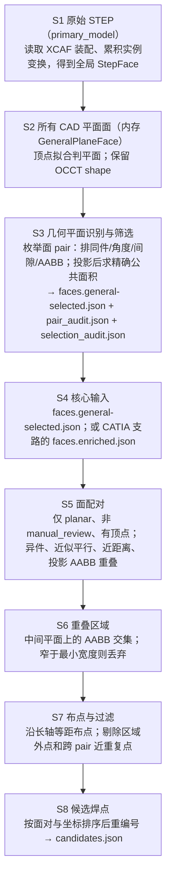

# 候选焊点算法

本文只描述当前代码实际会执行的几何处理。当前有两条可进入候选生成核心的输入链：通用选面链从已登记的主 STEP 文件生成 `faces.general-selected.json`；CATIA 全流程链生成 `faces.json` 并富化为 `faces.enriched.json` 后直接进入核心。后者**不会**再执行通用选面，也不存在 `faces.selected.json` 这个产物。

术语：**面（face）**是 CAD 模型边界上的一个曲面片；**平面面**是可由一个平面表示的面。**AABB**（axis-aligned bounding box）是与二维坐标轴平行的最小包围矩形，仅用作快速粗筛。**OCCT boolean common** 是 OpenCASCADE 对两个 CAD 形状求真实公共区域的布尔运算。

## S1：读取原始 CAD 几何

- 输入：受管原始数据的 `primary_model` STEP 文件；或活动 CATIA 文档（全流程支路）。
- 输出：通用选面支路得到按零件名分组的 `StepFace`；CATIA 支路得到 `faces.json` 和同一文档导出的 `component.stp`。
- 核心处理：`parse_step_faces` 用 XCAF 遍历 STEP 装配树，累积实例位置后将面转到装配全局坐标。它提取去重顶点、面积、重心和 OCCT 面形状；以顶点加两个曲面内部采样点做平面拟合，最大残差不超过 `0.01 mm` 才标为平面面。CATIA 提取支路则遍历 `Topology.CGMFace`，读取面积、平面、法向和重心；无法读取平面即标为非平面。
- 存在原因：后续的投影、间隙和重叠计算必须使用同一全局坐标系的面几何；CATIA COM 本身不能可靠地逐面枚举顶点。
- 修改或生成的数据、状态、文件：通用选面创建受管运行；全流程写入 `faces.json`（所有已扫描 CAD 面，顶点为空、`manual_review=true`）及 `component.stp`。两条受管入口任一异常均把运行清单标记为 `failed` 后重新抛出。
- 关键代码：`src/weld_core/step_geometry.py:parse_step_faces`、`_face_to_step_face`、`catia/extract_faces.py:extract_faces`、`catia/export_step.py:export_step`、`scripts/run_full_pipeline.py:main`。

## S2：CATIA 面顶点富化（仅 CATIA 全流程支路）

- 输入：`faces.json`、同一文档导出的 `component.stp`。
- 输出：`faces.enriched.json`；每个成功匹配的平面面补入 STEP 顶点并解除人工复核标记。
- 核心处理：按 `part` 分组，将 COM 平面面与 STEP 面组成候选组合。候选需同时满足重心距离不超过 `1.0 mm`、法向无向夹角不超过 `2°`、相对面积差不超过 `5%`；按“距离 + 角度×0.1 + 面积差×10”升序贪心做一对一匹配。匹配到的 STEP 面仍须通过平面判定，才复制顶点并设 `manual_review=false`。
- 存在原因：候选生成中的二维投影与 AABB 重叠需要顶点；原始 COM 提取故意不提供不可靠的顶点数据。
- 修改或生成的数据、状态、文件：原 `FacesDocument` 就地修改。STEP 缺少零件时写入该面原因；无候选或 STEP 面非平面时保留/设为 `manual_review=true`，这些面不会进入 S5；写出 `faces.enriched.json`。
- 关键代码：`scripts/enrich_faces_with_step.py:enrich_faces_document`、`_match_cost`、`_match_part_group`。

## S3：通用平面选面（STEP 选面支路）

- 输入：S1 的所有 `StepFace` 平面面及其 OCCT 形状、`GeneralSelectionParams`。
- 输出：`faces.general-selected.json`、`pair_audit.json`、`selection_audit.json`。
- 核心处理：先转为稳定编号的 `GeneralPlaneFace`，枚举全部无序 face pair。默认拒绝同一零件；再依次拒绝法向无向夹角大于 `0.5°`、平面间隙大于 `0.2 mm`、投影 AABB 无交或有效宽度小于 `0.1 mm` 的 pair。通过粗筛后，将第二面沿第一面法向平移至同一平面，以 OCCT 公共区域计算真实公共面积和双方覆盖率；公共面积至少 `1.0 mm²` 且两面覆盖率均至少 `0.05` 才接受。接受 pair 的两张面进入结果；同一面被多个 pair 支持时只保留一次，并记录全部支持 pair。
- 存在原因：用廉价几何条件缩小组合数量，再用 CAD 边界的精确公共面积避免把 AABB 相交但实际不相交的面选入。
- 修改或生成的数据、状态、文件：输出选中面的 `FacesDocument`（顶点已具备、`manual_review=false`、原因为 `generic_planar_selection`）；审计文件保留每一对的接受/拒绝原因和量测值，并记录未被任何接受 pair 支持的面。投影或布尔运算异常会转为该 pair 的拒绝原因，而非中断整次 pair 枚举；运行级异常将运行标为失败。
- 关键代码：`src/weld_core/general_plane_selection.py:general_faces_from_step_groups`、`select_general_planar_faces`、`evaluate_pair`、`exact_projected_pair_overlap`、`run_registered_general_plane_selection`；`src/weld_core/exact_face_overlap.py:exact_face_overlap`。

## S4：选择候选生成的面集

- 输入：`faces.general-selected.json`（通用选面链）或 `faces.enriched.json`（CATIA 全流程链）。
- 输出：传给 `weld_core.pipeline.run` 的 `FacesDocument`。
- 核心处理：两条链在此汇合；`run_full_pipeline.py` 实际传入富化后的全部面，通用选面回归/命令行则传入选中面。核心不按零件名、模板、参考 STEP 或历史标签改变算法。
- 存在原因：既支持无 CATIA 的 STEP 通用选面输入，也保留活动 CATIA 文档的提取—富化全流程。
- 修改或生成的数据、状态、文件：此步不改面数据。命令行从 `faces.general-selected.json` 读取时，会在最终候选元数据中附上该选面受管运行的来源；读取或数据校验失败时命令返回失败且不写候选文件。
- 关键代码：`src/weld_core/pipeline.py:main`、`run`、`_infer_general_selection_source`、`scripts/run_full_pipeline.py:main`。

## S5：配对可焊平面面

- 输入：S4 的面集、`WeldParams`。
- 输出：满足条件的 `(face_a, face_b)` 列表。
- 核心处理：先只保留 `surface_type="planar"`、`manual_review=false` 且有顶点的面。以法向量矩阵乘法一次计算所有无序对的无向夹角；对角度不超过 `5°` 的 pair，再依次排除同零件、平面间隙大于 `0.1 mm`、以及投影到第一面平面后二维 AABB 无交的 pair。
- 存在原因：只让几何数据完整且来自不同零件、位置相近的近似平行面进入区域和布点计算；矩阵化角度筛选减少大量 Python 双层循环。
- 修改或生成的数据、状态、文件：不改输入文件；不符合任一条件的面或 pair 被丢弃，不产生单独审计文件。
- 关键代码：`src/weld_core/pipeline.py:run`、`src/weld_core/pairing.py:find_mating_pairs`、`src/weld_core/config.py:WeldParams`。

## S6：构造配对重叠区域

- 输入：S5 的每一 face pair、顶点和参数。
- 输出：每对一个 `Region`，或 `None`。
- 核心处理：以第一面法向计算第二面有符号间隙，并把区域平面放在两面之间的中面。把两面的顶点投影到该平面，取两个二维 AABB 的交集；交集任一尺寸小于 `5.0 mm` 时返回 `None`，否则保存面 ID、中面、法向、二维包围盒、绝对间隙和法向夹角。
- 存在原因：候选点应位于两层面之间并限制在共同的可焊宽度内。
- 修改或生成的数据、状态、文件：仅创建临时 `Region`；无二维交或宽度不足的 pair 不进入 S7。
- 关键代码：`src/weld_core/region.py:build_region`、`src/weld_core/geometry.py:project_to_plane`、`aabb_overlap_2d`。

## S7：布点与去重

- 输入：S6 的每个 `Region`、间距参数。
- 输出：未编号的 `Candidate` 列表。
- 核心处理：取区域较长轴。长边小于 `20.0 mm` 时只在二维中心放一点；否则点数为 `max(2, ceil(长边/70.0)+1)`，在长轴两端间均匀布点，另一轴固定为中心，因此相邻间距不超过 `70.0 mm`。点反投影到中面，并由区域四角反投影得到三维 `region_bbox`。过滤先剔除超出自身 `region_bbox` 的点，再按生成顺序剔除与已保留点距离小于 `20.0 mm` 的跨 pair 近重复点。
- 存在原因：在每块有效搭接区域提供覆盖长边的候选点，并消除相邻面分割导致的重复候选。
- 修改或生成的数据、状态、文件：创建候选的位置、关联面、间距、区域包围盒和生成原因；被过滤候选不会写出。
- 关键代码：`src/weld_core/points.py:layout_points`、`_region_bbox_3d`、`src/weld_core/filtering.py:filter_candidates`。

## S8：稳定编号并写出候选

- 输入：S7 保留的候选、来源 `part` 和 `WeldParams`。
- 输出：`candidates.json` 中的 `CandidatesDocument`。
- 核心处理：按无序面 ID 对、再按三维坐标排序，依次改写为 `wc_001`、`wc_002`……；排序不依赖 CATIA 提取时的面发现顺序。候选元数据写入参数；若输入为受管通用选面文件，还写入 S4 所述的选面来源。
- 存在原因：相同物理候选在输入面顺序变化时仍获得稳定 ID，供后续 CATIA 回写按 ID 更新。
- 修改或生成的数据、状态、文件：生成并序列化候选文件；全流程把它登记为受管运行的 `candidates` 产物。候选生成函数本身不写文件，写入由 `pipeline.main` 或 `run_full_pipeline.py` 完成。
- 关键代码：`src/weld_core/pipeline.py:run`、`main`、`src/weld_core/schema.py:CandidatesDocument`、`dump_document`。
