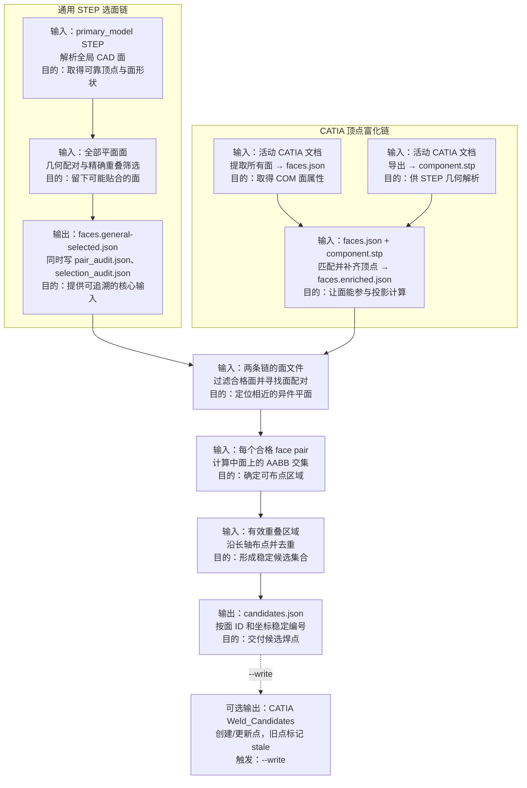

# 候选焊点算法流程

当前代码有两条真实的输入链。通用 STEP 选面链从原始数据登记的 `primary_model` STEP 文件生成 `faces.general-selected.json`；CATIA 全流程链从活动 CATIA 文档生成 `faces.json`，导出 `component.stp` 补齐顶点后得到 `faces.enriched.json`。两条链在候选生成核心汇合；代码中没有 `faces.selected.json`，CATIA 全流程也不会在富化后调用通用选面。

术语：**面（face）**是 CAD 模型边界上的一个曲面片；**平面面**是可由一个平面表示的面。**AABB** 是与二维坐标轴平行的最小包围矩形，用于快速排除不可能重叠的面。**OCCT 公共区域**是 OpenCASCADE 对两个 CAD 面求真实交叠边界和面积的计算。

## 步骤说明

| 步骤 | 输入 → 输出 | 核心处理与原因 | 条件、状态与关键代码 |
| --- | --- | --- | --- |
| A1 STEP 面解析 | 原始清单的 `primary_model` STEP → 按零件分组的内存 `StepFace` | 用 XCAF 遍历装配并累积实例变换，提取全局顶点、面积、重心和 OCCT 面形状；顶点加两个曲面内部采样点拟合平面。这样后续几何计算都在同一装配坐标系中进行。 | 最大平面拟合残差不超过 `0.01 mm` 才是平面面；解析失败使受管运行标为 `failed`。`src/weld_core/step_geometry.py:parse_step_faces`、`_face_to_step_face`。 |
| A2 通用平面选面 | `StepFace` 平面面 → 接受的面 ID 与逐 pair 审计 | 枚举无序面 pair，先以同件、法向、间隙和投影 AABB 粗筛，再把第二面投影到第一面平面并计算 OCCT 真实公共面积和双方覆盖率。先粗后精可减少布尔运算，同时避免仅 AABB 相交造成的误选。 | 默认拒绝同一零件；阈值依次为夹角 `0.5°`、间隙 `0.2 mm`、有效宽度 `0.1 mm`、公共面积 `1.0 mm²`、双方覆盖率 `0.05`。投影/布尔异常记录为该 pair 的拒绝原因，继续枚举其余 pair。`src/weld_core/general_plane_selection.py:evaluate_pair`、`select_general_planar_faces`、`src/weld_core/exact_face_overlap.py:exact_face_overlap`。 |
| A3 写出选面结果 | 接受的面和审计 → `faces.general-selected.json`、`pair_audit.json`、`selection_audit.json` | 将每张被至少一个接受 pair 支持的面写成候选生成可读的 `FacesDocument`，并保存所有接受/拒绝理由。这样输出既可直接使用，也可回溯选面依据。 | 选中面设为 `manual_review=false`，原因设为 `generic_planar_selection`；同一面只写一次但保留全部支持 pair。`src/weld_core/general_plane_selection.py:run_registered_general_plane_selection`、`selected_faces_document`。 |
| B1 CATIA 面提取 | 活动 CATIA 文档 → `faces.json` | 遍历 `Topology.CGMFace`，读取面积、平面、法向和重心。此文件提供 CATIA 所见的全部面属性。 | COM 无法可靠枚举逐面顶点，所以所有面初始为 `vertices=[]`、`manual_review=true`；无法读取平面时标为 `non_planar`。`catia/extract_faces.py:extract_faces`。 |
| B2 导出 STEP | 活动 CATIA 文档 → `component.stp` | 通过 CATIA 导出同一文档的 STEP 文件，供 B3 取得可靠的拓扑顶点。 | 只在 CATIA 全流程中生成；导出异常使该运行失败。`catia/export_step.py:export_step`、`scripts/run_full_pipeline.py:main`。 |
| B3 顶点富化 | `faces.json` + `component.stp` → `faces.enriched.json` | 按零件分组，以重心距离、法向夹角和面积差构成候选，再按综合代价贪心做一对一 COM/STEP 面匹配；成功的 STEP 平面面向 COM 面写入顶点。这样仅可信的面能进入候选核心。 | 阈值：重心距离 `1.0 mm`、夹角 `2°`、相对面积差 `5%`。STEP 缺零件、无匹配或匹配面非平面时保留/设为 `manual_review=true` 并写原因。`scripts/enrich_faces_with_step.py:enrich_faces_document`、`_match_part_group`。 |
| C1 合格面与配对 | `faces.general-selected.json` **或** `faces.enriched.json` → face pair 列表 | 只保留平面、非人工复核且有顶点的面；以矩阵计算全部法向夹角，再排除同件、间隙过大和投影 AABB 无交的 pair。这样只向后传递有足够几何证据的近似贴合面。 | 核心参数为夹角不超过 `5°`、间隙不超过 `0.1 mm`；拒绝的 pair 不写独立文件。`src/weld_core/pipeline.py:run`、`src/weld_core/pairing.py:find_mating_pairs`。 |
| C2 重叠区域 | 每个 face pair → `Region` 或无结果 | 在两面之间建立中面，将两组顶点投影到该平面，取二维 AABB 交集。候选点放在中面可代表两层贴合位置。 | 无交集或交集任一尺寸小于 `5.0 mm` 时返回 `None`，该 pair 不再布点。`src/weld_core/region.py:build_region`。 |
| C3 布点与去重 | `Region` → 未编号 `Candidate` 列表 | 沿区域长轴布点：长边小于 `20.0 mm` 时取中心一点，否则均匀布点且相邻距离不超过 `70.0 mm`；再剔除区域包围盒外点及跨 pair 距离小于 `20.0 mm` 的近重复点。这样覆盖有效区域并避免相邻面分割产生重复候选。 | 为每个保留点生成位置、关联面、间距、三维区域包围盒和原因。`src/weld_core/points.py:layout_points`、`src/weld_core/filtering.py:filter_candidates`。 |
| C4 候选文件 | 保留候选 → `candidates.json` | 按无序面 ID 对、再按坐标排序，编号为 `wc_001`、`wc_002`……，并写入来源和参数。排序不依赖 CATIA 的面发现顺序，保证同一物理候选的 ID 稳定。 | 通用选面文件作为输入时，元数据附带选面来源；文件由 `pipeline.main` 或全流程入口写出并登记为 `candidates` 产物。`src/weld_core/pipeline.py:run`、`main`。 |
| D1 可选 CATIA 回写 | `candidates.json` / 内存候选 → CATIA `Weld_Candidates` 零件与点集 | 创建或复用候选零件和几何集，按稳定 ID 新建点或更新点的坐标及信息参数。此步骤把算法结果显示到活动 CAD 文档，但不改变 `candidates.json`。 | 仅传入 `--write` 时执行；本轮不存在的旧点不删除，而是标记为 `stale`。`scripts/run_full_pipeline.py:main`、`catia/write_candidates.py:write_candidates`。 |
